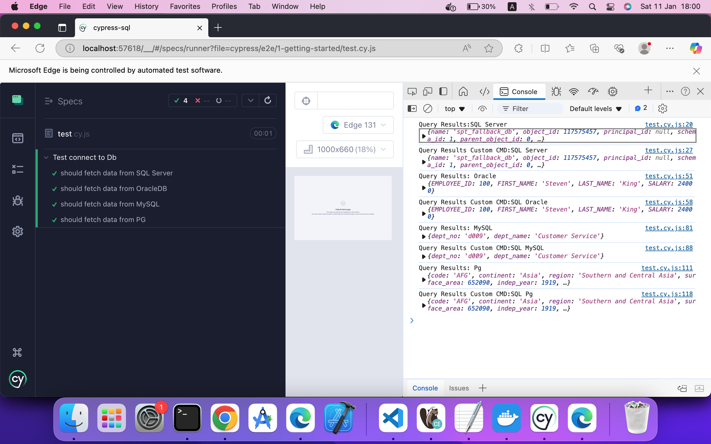

## Configure Cypress to Use `@dankieu/cypress-sql`

### 1. **Ensure TypeScript Configuration (`tsconfig.json`) is Set Up Properly**

In your `tsconfig.json` file, make sure to enable `esModuleInterop`:

```json
{
  "compilerOptions": {
    "esModuleInterop": true
  }
}
```

### 2. **Modify `cypress.config.ts` to Use the `@dankieu/cypress-sql` Package**

```typescript
import * as db from "@dankieu/cypress-sql";

export default defineConfig({
  e2e: {
    setupNodeEvents(on, config) {
      // Connect to SQL Server
      db.sqlServer(on);

      // Connect to Oracle
      db.sqlOracle(on);

      // Connect to MySQL
      db.sqlMySql(on);

      // Connect to PostgreSQL
      db.sqlPg(on);
    },
  },
});
```

---

## Available Database Connections

The `@dankieu/cypress-sql` package supports the following database connections:

- **SQL Server**: `db.sqlServer(on)`
- **Oracle Database**: `db.sqlOracle(on)`
- **MySQL**: `db.sqlMySql(on)`
- **PostgreSQL**: `db.sqlPg(on)`

Each of these methods establishes a connection to the respective database type when Cypress tests are running.

---

## 3: Import the Package in `e2e.ts`

In your `cypress/support/e2e.ts` file, simply import the `@dankieu/cmd` package. This will automatically add the custom SQL commands to Cypress.

### Example: `cypress/support/e2e.ts`

```typescript
import "@dankieu/cmd"; // Import @dankieu/cmd to initialize custom SQL commands
```

---

# Cypress Database Connection Tests

### 1. **SQL Server**
- **Test**: Fetch data from a SQL Server database.
- **Connection Config**:
  ```json
  {
    "user": "SA",
    "password": "Password789",
    "server": "localhost",
    "port": 1433,
    "database": "master",
    "options": {
      "encrypt": false,
      "trustServerCertificate": true
    }
  }
  ```
- **SQL Query**:
  ```sql
  SELECT * FROM sys.tables;
  ```
- **Custom Commands**:
  - Using `cy.task('sqlServer')`:
    ```typescript
    cy.task("sqlServer", { connectConfig: config, sqlQuery: sql }).then(results => {
      console.log("Query Results:SQL Server", results[0]);
    });
    ```
  - Using custom `cy.sqlServer()` command:
    ```typescript
    cy.sqlServer(config, sql).then(results => {
      console.log("Query Results Custom CMD:SQL Server", results[0]);
    });
    ```

### 2. **OracleDB**
- **Test**: Fetch data from an Oracle database.
- **Connection Config**:
  ```json
  {
    "user": "hr",
    "password": "hr",
    "connectString": "localhost:1521/orcl"
  }
  ```
- **SQL Query**:
  ```sql
  SELECT employee_id, first_name, last_name, salary FROM employees;
  ```
- **Custom Commands**:
  - Using `cy.task('sqlOracle')`:
    ```typescript
    cy.task("sqlOracle", { connectConfig: config, sqlQuery: sql }).then(results => {
      console.log("Query Results: Oracle", results[0]);
    });
    ```
  - Using custom `cy.sqlOracle()` command:
    ```typescript
    cy.sqlOracle(config, sql).then(results => {
      console.log("Query Results Custom CMD:SQL Oracle", results[0]);
    });
    ```

### 3. **MySQL**
- **Test**: Fetch data from a MySQL database.
- **Connection Config**:
  ```json
  {
    "host": "localhost",
    "user": "root",
    "password": "college",
    "database": "employees"
  }
  ```
- **SQL Query**:
  ```sql
  SELECT dept_no, dept_name FROM employees.departments;
  ```
- **Custom Commands**:
  - Using `cy.task('sqlMySql')`:
    ```typescript
    cy.task("sqlMySql", { connectConfig: dbConfig, sqlQuery: sql }).then(results => {
      console.log("Query Results: MySQL", results[0]);
    });
    ```
  - Using custom `cy.sqlMySql()` command:
    ```typescript
    cy.sqlMySql(dbConfig, sql).then(results => {
      console.log("Query Results Custom CMD:SQL MySQL", results[0]);
    });
    ```

### 4. **PostgreSQL**
- **Test**: Fetch data from a PostgreSQL database.
- **Connection Config**:
  ```json
  {
    "user": "world",
    "password": "world123",
    "host": "localhost",
    "port": 5432,
    "database": "world-db"
  }
  ```
- **SQL Query**:
  ```sql
  SELECT code, continent, region, surface_area, indep_year, population, life_expectancy, gnp, gnp_old, local_name, government_form, head_of_state, capital, code2 FROM public.country;
  ```
- **Custom Commands**:
  - Using `cy.task('sqlPg')`:
    ```typescript
    cy.task("sqlPg", { connectConfig: dbConfig, sqlQuery: sql }).then(results => {
      console.log("Query Results: Pg", results[0]);
    });
    ```
  - Using custom `cy.sqlPg()` command:
    ```typescript
    cy.sqlPg(dbConfig, sql).then(results => {
      console.log("Query Results Custom CMD:SQL Pg", results[0]);
    });
    ```

---
 # Sample result

